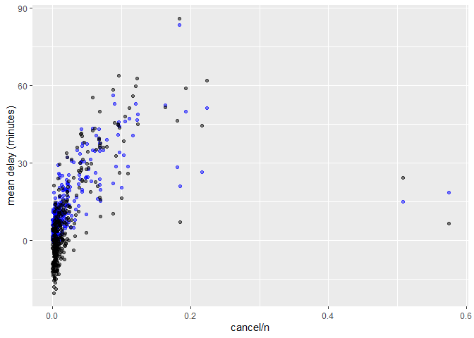

HW1
================
Daniela Orjuela-Diaz
2022-09-27

``` r
library(dplyr)
```

    ## Warning: package 'dplyr' was built under R version 4.1.3

    ## 
    ## Attaching package: 'dplyr'

    ## The following objects are masked from 'package:stats':
    ## 
    ##     filter, lag

    ## The following objects are masked from 'package:base':
    ## 
    ##     intersect, setdiff, setequal, union

``` r
library(nycflights13)
```

    ## Warning: package 'nycflights13' was built under R version 4.1.3

``` r
library(ggplot2)
```

    ## Warning: package 'ggplot2' was built under R version 4.1.3

## 1

There are 8255 row with NAs in the colum departure time. Departure
delay, arrival time, air time, and arrival delay are also missing this
probably indicates that all this flights were schedules but were
actually cancel at the time.

``` r
filter(flights, is.na(dep_time))
```

    ## # A tibble: 8,255 x 19
    ##     year month   day dep_time sched_de~1 dep_d~2 arr_t~3 sched~4 arr_d~5 carrier
    ##    <int> <int> <int>    <int>      <int>   <dbl>   <int>   <int>   <dbl> <chr>  
    ##  1  2013     1     1       NA       1630      NA      NA    1815      NA EV     
    ##  2  2013     1     1       NA       1935      NA      NA    2240      NA AA     
    ##  3  2013     1     1       NA       1500      NA      NA    1825      NA AA     
    ##  4  2013     1     1       NA        600      NA      NA     901      NA B6     
    ##  5  2013     1     2       NA       1540      NA      NA    1747      NA EV     
    ##  6  2013     1     2       NA       1620      NA      NA    1746      NA EV     
    ##  7  2013     1     2       NA       1355      NA      NA    1459      NA EV     
    ##  8  2013     1     2       NA       1420      NA      NA    1644      NA EV     
    ##  9  2013     1     2       NA       1321      NA      NA    1536      NA EV     
    ## 10  2013     1     2       NA       1545      NA      NA    1910      NA AA     
    ## # ... with 8,245 more rows, 9 more variables: flight <int>, tailnum <chr>,
    ## #   origin <chr>, dest <chr>, air_time <dbl>, distance <dbl>, hour <dbl>,
    ## #   minute <dbl>, time_hour <dttm>, and abbreviated variable names
    ## #   1: sched_dep_time, 2: dep_delay, 3: arr_time, 4: sched_arr_time,
    ## #   5: arr_delay

## 2

``` r
mutate(flights,
       dep_time = (dep_time %/% 100) * 60 + (dep_time %% 100),
       sched_dep_time = (sched_dep_time %/% 100) * 60 + (sched_dep_time %% 100))
```

    ## # A tibble: 336,776 x 19
    ##     year month   day dep_time sched_de~1 dep_d~2 arr_t~3 sched~4 arr_d~5 carrier
    ##    <int> <int> <int>    <dbl>      <dbl>   <dbl>   <int>   <int>   <dbl> <chr>  
    ##  1  2013     1     1      317        315       2     830     819      11 UA     
    ##  2  2013     1     1      333        329       4     850     830      20 UA     
    ##  3  2013     1     1      342        340       2     923     850      33 AA     
    ##  4  2013     1     1      344        345      -1    1004    1022     -18 B6     
    ##  5  2013     1     1      354        360      -6     812     837     -25 DL     
    ##  6  2013     1     1      354        358      -4     740     728      12 UA     
    ##  7  2013     1     1      355        360      -5     913     854      19 B6     
    ##  8  2013     1     1      357        360      -3     709     723     -14 EV     
    ##  9  2013     1     1      357        360      -3     838     846      -8 B6     
    ## 10  2013     1     1      358        360      -2     753     745       8 AA     
    ## # ... with 336,766 more rows, 9 more variables: flight <int>, tailnum <chr>,
    ## #   origin <chr>, dest <chr>, air_time <dbl>, distance <dbl>, hour <dbl>,
    ## #   minute <dbl>, time_hour <dttm>, and abbreviated variable names
    ## #   1: sched_dep_time, 2: dep_delay, 3: arr_time, 4: sched_arr_time,
    ## #   5: arr_delay

## 3

``` r
flights %>%
  mutate(dep_date = lubridate::make_datetime(year, month, day)) %>%
  group_by(dep_date) %>%
  summarise(cancel = sum(is.na(dep_delay)), 
            n = n(),
            mean_dep_delay = mean(dep_delay,na.rm=TRUE),
            mean_arr_delay = mean(arr_delay,na.rm=TRUE)) %>%
    ggplot(aes(x= cancel/n)) + 
    geom_point(aes(y=mean_dep_delay), colour='blue', alpha=0.5) + 
    geom_point(aes(y=mean_arr_delay), colour='black', alpha=0.5) + 
    ylab('mean delay (minutes)')
```

<!-- -->
